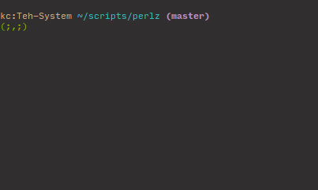

# Mow The Lawn
> A portable, and silly, mowing-the-lawn animation spinner for bash

</br>
</br>

#### Table of Contents

* [Overview](#overview)
* [Getting Started](#getting-started)
* [Script Options](#script-options)

## Overview



## Getting Started
1. Copy paste the MowTheLawn.pm into a script

2. Make the script executable

   ```
   chmod +x NameOfFile.pm
   ```

3. Run that bad boy!

   ```bash
   perl NameOfFile.pm --loop-without-pid
   ```

   or as the animation for a 'long running process'

   ```bash
   sleep 5 & NameOfFile.pm
   ```

## Script Options

| key                | type    | description                                                          | required | example                  |
|--------------------|---------|----------------------------------------------------------------------|----------|--------------------------|
| --mower            | string  | The text used to create the mower                                    | optional | --mower '`.==.'          |
| --mower-color      | string  | The color codes for the mower                                        | optional | --mower-color '38;5;106' |
| --grass            | string  | The text used to create the grass. One char limit                    | optional | --grass ','              |
| --lawn-color       | string  | The color codes for the grass                                        | optional | --lawn-color '38;5;106'  |
| --lawn-length      | Integer | The number of blades of grass                                        | optional | --lawn-length 40         |
| --speed            | Integer | The speed (sleep time), between animation frames. Shorter is faster  | optional | --speed 100              |
| --pid              | Integer | The parent process pid (used to explicitly pass a parent process id) | optional | --pid PID_HERE           |
| --loop-without-pid | Boolean | Forces the animation to run continuosly, without parent process pid  | optional | --loop-without-pid       |
